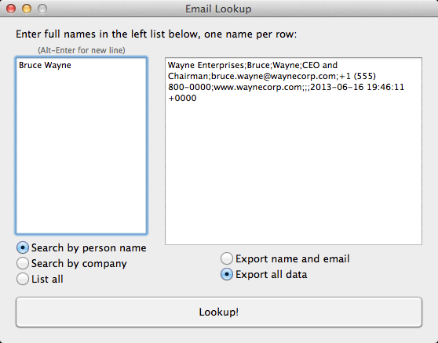

# Email Lookup for Mac OS X

[Read about Email Lookup on my blog](http://blog.tomsoderlund.com/post/37632043823/email-lookup-for-mac-os-x)

**Email Lookup** takes a list of people names or company names, and adds email (and other data when in company search mode) from your own Mac OS X Address Book.

Here is an example of a search:

